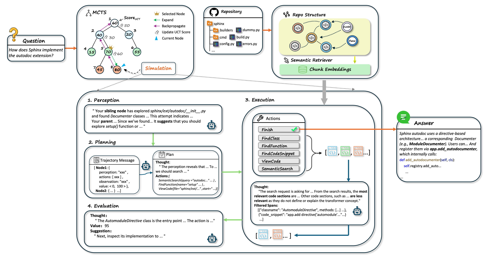

# DeepRepoQA

[](LICENSE)
[](https://www.python.org/)
[]()

## Introduction

DeepRepoQA is a project for deep repository question answering.

## Features


## Installation

### Requirements

- Python 3.12
- Other dependencies...

### Installation Steps

```bash
# Install dependencies
pip install -r requirements.txt

# Install project
pip install -e .
```

## Quick Start

```python
# Example code
from deeprepoqa import DeepRepoQA

# Initialize
qa = DeepRepoQA()

# Usage example
result = qa.ask("Your question")
print(result)
```

## Usage

### Basic Usage

Detailed usage instructions...

### Advanced Configuration

Advanced configuration options...

## Project Structure

```
```

## Contributing

Contributions are welcome! Please follow these steps:


## License

This project is licensed under the MIT License - see the [LICENSE](LICENSE) file for details.

## Contact


## Acknowledgments

